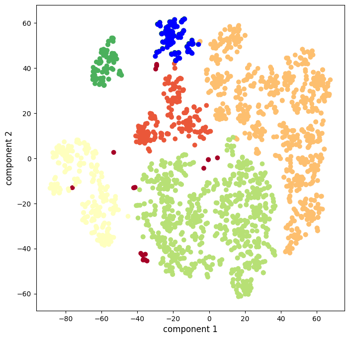

# Анализ Фильмов на Кинопоиске
 
Анализ фильмов с использованием информации, предоставляемой Кинопоиском. Реализовано с использованием Python, Jupyter Notebook и библиотек:

1. requests (запросы для получения json с информацией)
2. pandas (обработка информации в формате датафреймов)
3. numpy (алгераические операции)
4. sklearn (алгоритмы и метрики для тестирования алгоритмов)
5. matplotlib (визуализация)

## Основые этапы работы
1. Получение датасета с помощью Kinopoisk API и обработка данных (кодировка категориальных параметров).
2. Нормализация данных и уменьшение размерности датасета с использованием алгоритма t-SNE.
3. Расчет оптимальных параметров алгоритма и последующая кластеризация с использованием DBSCAN.
4. Интерпретация полученных кластеров.

## Заключение

Полученные кластеры:

1. Зарубежные трагикомедии (светло-красный): данные фильмы преимущественно относятся к жанрам комедия, драма и мелодрама и произведены в США, Франции и Великобритании.
2. Американские боевики (бежевый): почти все данные фильмы произведены в США и относятся к жанрам боевик, приключения, триллер.
3. Российское кино (желтый): почти все фильмы в данной группе произведены в России, преимущественно драмы и комедии.
4. Американские драматические триллеры (салатовый): данные фильмы в основном относятся к жанрам драма, триллер и детектив и произведены, по большей части, в США.
5. Фильмы СССР (зеленый): все фильмы в данной категории были произведены в СССР.
6. Зарубежные комедийные мелодрамы (темно-зеленый): данные фильмы в основном произведены в США, а также во Франции и Великобритании и относятся к жанрам мелодрама и комедия. Судя по содержанию, данный кластер должен быть единым вместе с Зарубежными трагикомедиями (светло-красные).
7. Выбросы (темно-красный): В данную категорию попали иностранные фильмы (зарубежные по Голливудским меркам), которые имеют высокую оценку на Кинопоиске (медианное значение почти 8), например “Паразиты” - Южная Корея, “Укрощение строптивого” - Италия и “Мой Хатико” - Китай.